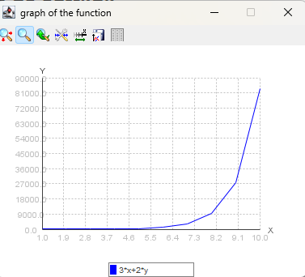

# Euler 2 y Runge Kutta 4

Este repositorio contiene un programa en Java para resolver un sistema de ecuaciones diferenciales utilizando el método
de Euler y Runge Kutta. El programa solicita la entrada del usuario para parámetros como el tamaño del paso **(h)**,
condiciones
iniciales **(x1 e y1)**, y el rango de iteraciones. Luego realiza los cálculos y muestra los resultados tanto en forma
tabular como gráfica.

## Tabla de Contenidos

- [Requisitos Previos](#requisitos-previos)
- [Instalación](#instalación)
- [Formatos de Entrada](#Formato-de-entrada)
- [Ejemplo de Entrada](#Ejemplo-de-entrada)
- [Ejemplo de salida](#ejemplo-de-salida)
- [Dependencias](#dependencias)
- [Nota](#nota)

## Requisitos Previos

Antes de ejecutar la aplicación, asegúrese de tener instalados los siguientes requisitos previos:

1. [x] Java 8 o posterior
2. [x] Maven

## Instalación

Para instalar la aplicación, siga los siguientes pasos:

1. Clone el repositorio en su máquina local:

```bash
git clone https://github.com/OmerJuve2023/Calculadora_Euler_RungeKutta.git
```

2. Navegue a la carpeta del proyecto:

```bash
cd Calculadora_Euler_RungeKutta
```

3. Compile el proyecto:

```bash 
mvn clean install
```

4. Ejecute el proyecto:

```bash
java -jar target/Calculadora_Euler_RungeKutta-1.2.1.jar
```

## Formato de entrada

* **h:** Tamaño del paso para cada iteración.
* **Función A y Función B:** Expresiones matemáticas que representan el sistema de ecuaciones diferenciales.
* **x1 e y1:** Condiciones iniciales para las variables.
* **Rango inicial y rango final:** El rango de iteraciones.

## Ejemplo de entrada

```shell script
INGRESE QUE METODO SE USARA: EULER (E) RUNGE KUTTA(R)
e
range final:10
INGRESS h: 1
INGRESS x1: 1
INGRESS y1: 2
INGRESS FUNCTION: F(X,Y)=3*x+2*y
```    

## Ejemplo de salida

El programa mostrará los resultados de cada iteración tanto en forma tabular como gráfica. Además, te preguntará si
deseas continuar con otro conjunto de valores de entrada

``` shell script
interactions		X			y
	1	|		1.00	|	02
	2	|		2.00	|	09
	3	|		3.00	|	33
	4	|		4.00	|	108
	5	|		5.00	|	336
	6	|		6.00	|	1023
	7	|		7.00	|	3087
	8	|		8.00	|	9282
	9	|		9.00	|	27870
	10	|		10.00	|	83637
```

```shell script
n =    1  	  x1 =    2  
  y2    =   2  +  1.0  (  3*  (  1.0  )  +2*  (  2.0  )    )  
  y2    =   2  +  1.0  (  7  )  
  y2    =     9  
  ------------------------------------------------------------------------------  
  n =    2  	  x2 =    3  
  y3    =   9  +  1.0  (  3*  (  2.0  )  +2*  (  9.0  )    )  
  y3    =   9  +  1.0  (  24  )  
  y3    =     33  
  ------------------------------------------------------------------------------  
  n =    3  	  x3 =    4  
  y4    =   33  +  1.0  (  3*  (  3.0  )  +2*  (  33.0  )    )  
  y4    =   33  +  1.0  (  75  )  
  y4    =     108  
  ------------------------------------------------------------------------------  
  n =    4  	  x4 =    5  
  y5    =   108  +  1.0  (  3*  (  4.0  )  +2*  (  108.0  )    )  
  y5    =   108  +  1.0  (  228  )  
  y5    =     336  
  ------------------------------------------------------------------------------  
  n =    5  	  x5 =    6  
  y6    =   336  +  1.0  (  3*  (  5.0  )  +2*  (  336.0  )    )  
  y6    =   336  +  1.0  (  687  )  
  y6    =     1023  
  ------------------------------------------------------------------------------  
  n =    6  	  x6 =    7  
  y7    =   1023  +  1.0  (  3*  (  6.0  )  +2*  (  1023.0  )    )  
  y7    =   1023  +  1.0  (  2064  )  
  y7    =     3087  
  ------------------------------------------------------------------------------  
  n =    7  	  x7 =    8  
  y8    =   3087  +  1.0  (  3*  (  7.0  )  +2*  (  3087.0  )    )  
  y8    =   3087  +  1.0  (  6195  )  
  y8    =     9282  
  ------------------------------------------------------------------------------  
  n =    8  	  x8 =    9  
  y9    =   9282  +  1.0  (  3*  (  8.0  )  +2*  (  9282.0  )    )  
  y9    =   9282  +  1.0  (  18588  )  
  y9    =     27870  
  ------------------------------------------------------------------------------  
  n =    9  	  x9 =    10  
  y10    =   27870  +  1.0  (  3*  (  9.0  )  +2*  (  27870.0  )    )  
  y10    =   27870  +  1.0  (  55767  )  
  y10    =     83637  
  ------------------------------------------------------------------------------
```



## Dependencias

```xml

<dependencies>
    <dependency>
        <groupId>org.scijava</groupId>
        <artifactId>jep</artifactId>
        <version>2.4.2</version>
    </dependency>
    <dependency>
        <groupId>com.github.yannrichet</groupId>
        <artifactId>JMathPlot</artifactId>
        <version>1.0.1</version>
    </dependency>
    <dependency>
        <groupId>org.example</groupId>
        <artifactId>createPng</artifactId>
        <version>1.0</version>
    </dependency>
    <dependency>
        <groupId>org.projectlombok</groupId>
        <artifactId>lombok</artifactId>
        <version>1.18.30</version>
        <scope>provided</scope>
    </dependency>
</dependencies>
```

## Nota

Este programa utiliza el una dependencia `createPng` para generar la gráfica, sin embargo, esta dependencia no se
encuentra
en el repositorio de Maven, por lo que se debe instalar manualmente. Para ello, debe de ejecutar el siguiente
repositorio o descargar la version 1.0 de la dependencia desde el siguiente enlace:

[https://github.com/OmerJuve2023/createPng/commits/v1.0](https://github.com/OmerJuve2023/createPng/commits/v1.0)

```shell script
git clone https://github.com/OmerJuve2023/createPng.git
```

luego debe de instalar la dependencia en su repositorio local de Maven:

```shell script
mvn clean install
```
